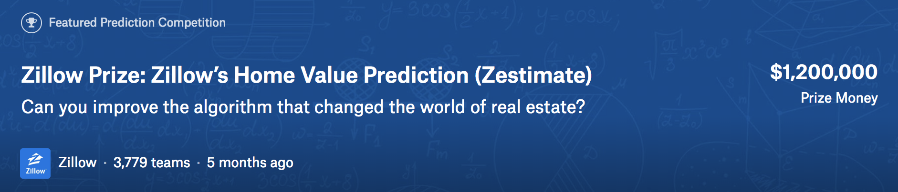
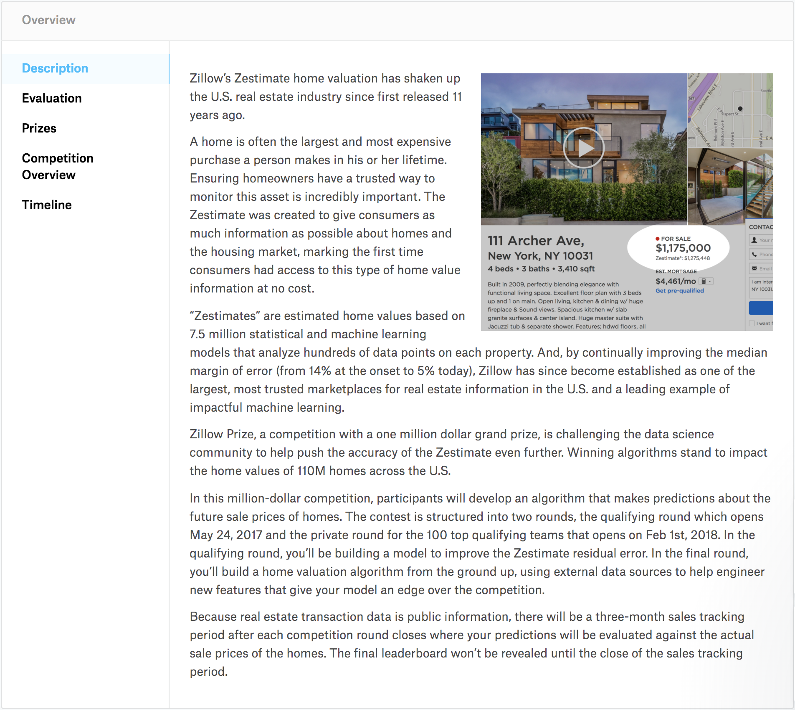

# Regression-Analysis-Team-Project
```Kaggle Data : Zillow’s Home Value Prediction를 사용한 회귀분석 프로젝트```
</br>



</br>

## [ 활동 로그 ]
### EDA
- *2018/06/19 (화)*
	- 이전까지 각자 진행했던 EDA를 공유
	- 80 ≤ missing ratio를 갖는 컬럼을 처리하기 하기 위해 각자의 분석 할당량 분할

- *2018/06/20 (수)*
	- 어제 각자 맡은 컬럼을 분석한 내용을 브리핑하고, 해당 컬럼 제거 여부와 NaN 값 처리에 대해 토론
	
    	➜ missing ratio가 80% 이상되면 종속변수를 알아내는데 영향이 미미할 것으로 보고 모두 제거하기로 하였음
    
    - 30 ≤ missing ratio < 80 사이의 값을 갖는 컬럼을 어떻게 처리할지 토론
    
    	➜ 각 컬럼들을 분석해보았을때, 대부분 missing ratio가 높고 중요도가 높지 않다고 생각되어, 대부분 제거하기로 하였지만 몇몇 컬럼들은 좀 더 확인해 볼 필요가 있다고 판단되어 기록해두었다가 추후 재검토하기로 하였음
	
    - missing value < 30에 해당하는 25개의 컬럼 분석에 대해 토론
     	
        ➜ 25개 중 단 2개의 컬럼만이 약 9%의 missing ratio를 갖고 나머지 컬럼들은 모두 4% 미만의 컬럼
        
        ➜ 회귀분석에 있어서 주요 피처가 될 가능성이 높다고 판단되어 모든 변수에 대해 다 함께 면밀히 EDA를 진행하고 토론하기로 하였음 
    
    